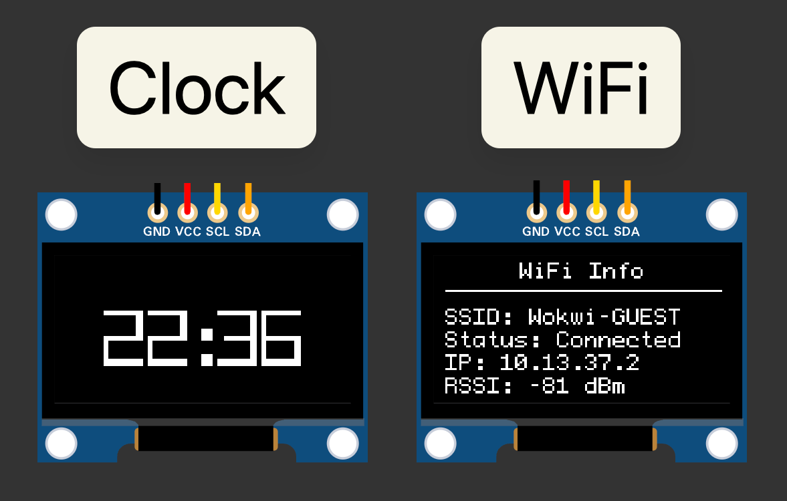

<h1 align="center">Jarvis: Desk Buddy</h1>
<p align="center">
An open-source desk buddy that blinks, tells the time, and notices when you're near.
</p>
<p align="center">
    
    
    
    <br>
    
</p>

<p align="center">
    
</p>

## Overview

Jarvis is an open-source desktop companion built on an ESP32. It shows a pair of animated eyes on an OLED display, keeps the time synced over WiFi, and uses an ultrasonic sensor to notice when you get close, looking up and reacting when you're near.

Timekeeping is handled over the network: the ESP32 connects to WiFi and syncs to an NTP server on boot, with automatic daylight-saving handling for the local timezone, so there's no dedicated RTC to keep set. The eyes are driven by the FluxGarage RoboEyes library, and a button lets you switch between moods and views.

The project is designed to be:

- Expressive, with animated eyes that blink, glance around, and react to presence.
- Easy to read, with a crisp OLED display and a WiFi-synced clock.
- Simple to build, on a single USB-C-powered board.
- Hackable and well-documented, as a learning reference for embedded projects.

### Pinout

The table below maps each component to its ESP32 GPIO. For the full wiring, the complete schematic is available as a [PDF](./docs/schematic.pdf), and the entire [KiCad project](./docs/jarvis_kicad/) is included too, with the BOM and component details across several distributors.

<table>
  <thead>
    <tr>
      <th>Component</th>
      <th>Component Pin</th>
      <th>ESP32 GPIO</th>
      <th>Notes</th>
    </tr>
  </thead>
  <tbody>
    <tr>
      <td rowspan="4"><a href="https://www.lcsc.com/product-detail/C5248080.html" target="_blank">OLED Display (SSD1306, I²C)</a></td>
      <td>VCC</td>
      <td>3V3</td>
      <td>Do not use 5V / VIN</td>
    </tr>
    <tr>
      <td>GND</td>
      <td>GND</td>
      <td>Common ground</td>
    </tr>
    <tr>
      <td>SDA</td>
      <td>GPIO21</td>
      <td>I²C data</td>
    </tr>
    <tr>
      <td>SCL</td>
      <td>GPIO22</td>
      <td>I²C clock</td>
    </tr>
    <tr>
      <td rowspan="2"><a href="https://www.lcsc.com/product-detail/C52750873.html" target="_blank">Next Screen Button</a></td>
      <td>Pin 1</td>
      <td>GPIO32</td>
      <td>INPUT_PULLUP; pressed = LOW</td>
    </tr>
    <tr>
      <td>Pin 2</td>
      <td>GND</td>
      <td>Other leg to ground</td>
    </tr>
    <tr>
      <td rowspan="2"><a href="https://www.lcsc.com/product-detail/C52750873.html" target="_blank">Previous Screen Button</a></td>
      <td>Pin 1</td>
      <td>GPIO27</td>
      <td>INPUT_PULLUP; pressed = LOW</td>
    </tr>
    <tr>
      <td>Pin 2</td>
      <td>GND</td>
      <td>Other leg to ground</td>
    </tr>
  </tbody>
</table>

---

## Getting Started

### Prerequisites

- [PlatformIO](https://platformio.org/) (VS Code extension or CLI).
- An ESP32 board, an SSD1306 OLED and two push buttons _(or just the Wokwi simulator, see below)_.

### Configuration

Wi-Fi credentials are kept out of version control. Copy the template and fill in your own:

```bash
cp secrets.h.example secrets.h
```

Then edit `secrets.h` with your network details:

```cpp
#define WIFI_SSID "your_wifi"
#define WIFI_PASS "your_password"
```

### Build & Flash

```bash
pio run              # compile
pio run -t upload    # flash to the board
pio device monitor   # open the serial monitor
```

### Run in the simulator (no hardware needed)

You can run Jarvis entirely in VS Code without any physical hardware using the [Wokwi](https://wokwi.com/) simulator.

1. Install the **Wokwi Simulator** extension for VS Code.
2. Create a `wokwi.toml` file in the project root with the following content:

    ```toml
      [wokwi]
      version = 1
      firmware = ".pio/build/jarvis/firmware.bin"
      elf = ".pio/build/jarvis/firmware.elf"
    ```

3. Add a `diagram.json` in the project root describing the circuit. You can copy it from the public Wokwi project here: [wokwi.com/projects/469374163665964033](https://wokwi.com/projects/469374163665964033).

4. Set your credentials to Wokwi's guest network in `secrets.h`:

    ```cpp
    #define WIFI_SSID "Wokwi-GUEST"
    #define WIFI_PASS ""
    ```

5. Build the firmware with `pio run`, then open `diagram.json` and start the simulator.

---

<h3 align="center">License</h3>
<pre align="center">Copyright © 2026 Carmen<br><br>Jarvis is open-source and released under the MIT License.<br><br>See <a href="./LICENSE.md">LICENSE.md</a> for the full details.</pre>

<h3 align="center">Credits &amp; Team</h3>
<p align="center">Built and maintained by Carmen :)</p>
<p align="center">
    <a href="https://github.com/carmoruda/Chronos-Ion/graphs/contributors">
        
    </a>
</p>
